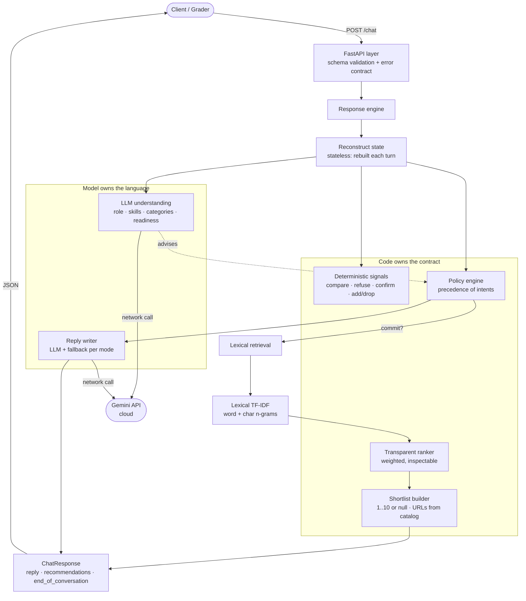

# SHL Assessment Recommender

A conversational service that recommends **SHL Individual Test Solutions** assessments
from a hiring need, over a small, stateless HTTP API. It clarifies a vague request,
recommends 1–10 assessments, refines the shortlist as constraints change, compares
products using catalog facts, and refuses out-of-scope or unsafe requests.

**Live:** <https://hriday29-shl-assessment-recommender.hf.space>
· **chat UI:** [`/`](https://hriday29-shl-assessment-recommender.hf.space/) (the root)
· health: [`/health`](https://hriday29-shl-assessment-recommender.hf.space/health)
· API docs: [`/docs`](https://hriday29-shl-assessment-recommender.hf.space/docs)

> **Want to try it as a user?** Open the [live Space](https://hriday29-shl-assessment-recommender.hf.space/)
> and chat — describe who you're hiring for and watch it clarify, recommend, and refine.
> The `/health` and `/chat` HTTP endpoints are the machine-facing contract; the chat box
> at the root is a convenience client of that same stateless API.

---

## Table of contents

- [What it does](#what-it-does)
- [Design in one line](#design-in-one-line)
- [Architecture](#architecture)
- [How a turn is handled](#how-a-turn-is-handled)
- [API](#api)
- [Quick start (local)](#quick-start-local)
- [Configuration](#configuration)
- [Testing & evaluation](#testing--evaluation)
- [Deployment](#deployment)
- [How it was built](#how-it-was-built)
- [Project layout](#project-layout)

---

## What it does

Given the conversation so far, the service handles each turn as one of five things:

| Behaviour | When | Example |
| --------- | ---- | ------- |
| **Clarify** | the request is too vague to recommend well | "I need an assessment." → asks one focused question |
| **Recommend** | there is enough to commit a shortlist | "Java developer, screen Java + SQL" → Java 8, SQL, Java Frameworks, + staples |
| **Refine** | a shortlist exists and the user edits it | "add a personality test", "drop the OPQ" |
| **Compare** | the user asks to compare named products | "difference between DSI and Safety & Dependability 8.0?" — answered from catalog facts |
| **Refuse** | off-topic, legal, or a prompt-injection attempt | "give me legal advice", "ignore your instructions" → declines, redirects |

The conversation ends when the user accepts a shortlist; the closing turn re-shows the
accepted assessments.

## Design in one line

> **Use the model for language, use code for control.**

The language model interprets the messy request and writes the reply's prose. **Code
owns everything the grader checks** — the response schema, the recommendation list,
every URL and `test_type` (copied verbatim from the catalog, never generated), the
clarifying-question budget, and the turn cap. A model that hallucinates can make a
reply slightly less good; it can never make the output invalid or unsafe. Every path
that uses the model has a deterministic fallback, so an LLM outage degrades wording,
never correctness.

## Architecture



**The split is the point.** Everything in *Code owns the contract* is deterministic and
tested; everything in *Model owns the language* is advisory with a fallback. The two
Gemini calls are network calls to the cloud — they cost no local memory. Retrieval is
lexical (TF-IDF) and runs entirely in-process with no model to load, so there is no
in-process ML dependency to fail. (An earlier build also carried a semantic-embedding
stage; it was measured to add no Recall@10 and removed — see
[`docs/retrieval_design.md`](docs/retrieval_design.md).)

The full reasoning behind every decision is in
[`ARCHITECTURE_DECISIONS.md`](ARCHITECTURE_DECISIONS.md); the per-subsystem design notes
are under [`docs/`](docs/).

## How a turn is handled

1. **Validate** the request against the schema (a bad body returns a stable `422`).
2. **Reconstruct state** from the full history — the service stores nothing between
   requests.
3. **Detect signals** deterministically (comparison, refusal, injection, confirmation,
   add/drop) and, when it can change the outcome, run **LLM understanding** for the
   open-ended parts.
4. **Decide the mode** by a precedence of intents (refuse → confirm → compare → refine →
   recommend → clarify), with the model *advising* the clarify-vs-commit call and code
   holding the budget and turn cap.
5. **Retrieve** (only on a committing turn) with lexical (TF-IDF) search, then
   **rank** with a transparent weighted scorer.
6. **Build the shortlist in code** — 1..10 items or `null`, every field copied from the
   catalog.
7. **Write the reply** with the model, falling back to a deterministic message per mode.
8. **Assemble and validate** the `ChatResponse`, then return it.

## API

Two endpoints. Interactive docs at [`/docs`](https://hriday29-shl-assessment-recommender.hf.space/docs).

### `GET /health`

Returns exactly `{"status": "ok"}` with HTTP `200` while the service can do its job
(`ok` or `degraded`), and `503` when it cannot (`unhealthy`). The body is deliberately
the single `status` key so a strict `{"status":"ok"}` check is never tripped by extra
fields.

```bash
curl https://hriday29-shl-assessment-recommender.hf.space/health
```

```json
{ "status": "ok" }
```

Add `?deep=1` for the richer diagnostic body — per-component readiness plus the build
identity — and to additionally make one real model call that confirms the provider key
works:

```bash
curl "https://hriday29-shl-assessment-recommender.hf.space/health?deep=1"
```

```json
{
  "status": "ok",
  "build": { "service": "shl-recommender", "version": "0.1.0", "commit": "..." },
  "components": [
    { "name": "catalog",        "status": "ok", "detail": "377 items loaded" },
    { "name": "language_model", "status": "ok", "detail": "configured" }
  ]
}
```

### `POST /chat`

Takes the full conversation history, returns exactly three fields.

```bash
curl -X POST https://hriday29-shl-assessment-recommender.hf.space/chat \
  -H "Content-Type: application/json" \
  -d '{"messages":[{"role":"user","content":"Hiring a senior Java developer; screen Java and SQL."}]}'
```

```json
{
  "reply": "Based on what you've described, here are the assessments I'd recommend.",
  "recommendations": [
    { "name": "Java 8 (New)", "url": "https://www.shl.com/...", "test_type": "K" },
    { "name": "SQL (New)",    "url": "https://www.shl.com/...", "test_type": "K" }
  ],
  "end_of_conversation": false
}
```

**Response contract:** `recommendations` is either `null` (while clarifying or refusing)
or a list of **1–10** items — never `[]`. Each `test_type` is a known catalog code. On
any failure the service returns a stable error envelope (`{"error": {"type", "message"}}`)
— never a leaked stack trace: model failure → `502`, bad request → `422`, anything else →
a generic `500`.

#### Holding a multi-turn conversation (the service is stateless)

The server stores nothing between calls, so **the caller maintains the conversation by
resending the full history each turn** — append the assistant's last `reply` as an
`assistant` message and add the new user message. This is the whole protocol; a grader's
harness drives it exactly this way. For example, the second turn of a conversation:

```bash
curl -X POST https://hriday29-shl-assessment-recommender.hf.space/chat \
  -H "Content-Type: application/json" \
  -d '{"messages":[
    {"role":"user","content":"Hiring a senior Java developer"},
    {"role":"assistant","content":"What skills matter most for this role?"},
    {"role":"user","content":"Java and SQL, plus a cognitive test"}
  ]}'
```

No chat UI is needed to use or test the service — it is an HTTP API. The bundled chat UI
(and the [`scripts/chat_client.py`](scripts/chat_client.py) terminal client below) are
*clients* of this stateless API, not a change to it.

#### Inspecting a turn's reasoning — `?debug=1`

Add `?debug=1` to `/chat` to receive, alongside the three contract fields, a `_trace`
object explaining **how the turn was decided**: the state extracted from the conversation,
the mode chosen and why, the readiness judgement (and whether the model or the structural
fallback decided it), the scored retrieval candidates, and whether the reply came from the
model or a deterministic fallback. It is **opt-in and strictly additive** — the three
contract fields are identical with or without it, so a grader gets the clean contract by
default and the full X-ray only on request. The trace never contains a secret.

```bash
curl -X POST "https://hriday29-shl-assessment-recommender.hf.space/chat?debug=1" \
  -H "Content-Type: application/json" \
  -d '{"messages":[{"role":"user","content":"Hiring a senior Java developer; screen Java and SQL."}]}'
```

#### Terminal chat client

For a human who wants to hold a conversation without the browser, a small client keeps the
history for you and posts each turn:

```bash
python -m scripts.chat_client                 # talks to the deployed Space
python -m scripts.chat_client --debug         # shows the ?debug=1 trace under each reply
python -m scripts.chat_client --url http://127.0.0.1:8000   # a local server
```

At the prompt, `:debug` toggles the trace, `:history` prints the raw message list being
sent (so you can see the statelessness), `:reset` starts over, `:quit` exits.

## Quick start (local)

Requires **Python 3.12+**.

```bash
cp .env.example .env          # then paste your Gemini API key into GEMINI_API_KEY
make install                  # install pinned dependencies
make test                     # run the full suite
make run                      # serve on http://127.0.0.1:8000
```

Without an API key the service still runs and returns valid responses — the model-written
parts fall back to deterministic wording. Set the key to get model-authored replies.

## Configuration

All configuration is environment-driven and fully documented in
[`.env.example`](.env.example). Every setting has a safe default; only the model provider
key is required for model-authored replies. Notable knobs:

| Variable | Default | Purpose |
| -------- | ------- | ------- |
| `SHL_LLM_MODEL` | `gemini/gemini-2.5-flash` | Provider/model (LiteLLM form); swap providers with no code change |
| `SHL_MAX_CLARIFYING_QUESTIONS` | `2` | Questions allowed before a first shortlist |
| `SHL_LOG_FORMAT` | `json` | `json` for a collector, `console` for local runs |
| `GEMINI_API_KEY` | — | The provider key (a Space secret in production) |
| `SHL_GEMINI_API_KEY_FALLBACK` | — | Optional second key; used only when the primary is rate-limited (429) or rejected, so a burst does not force fallback wording |
| `SHL_LLM_FALLBACK_MODEL` | — | Optional cross-provider fallback model (e.g. `groq/llama-3.3-70b-versatile`), tried last when the primary provider is exhausted on both keys; a generous free tier here removes the quota problem |

## Testing & evaluation

```bash
make test        # full suite (unit + HTTP + property + trace-replay)
make recall      # Recall@10 scoreboard against the sample conversations
```

The suite includes:

- **Unit tests** for every module.
- **HTTP-level tests** through FastAPI's `TestClient` (both endpoints, the error
  contract, model-down resilience).
- **Property tests** (Hypothesis) asserting that for arbitrary histories `/chat` never
  returns a 5xx and always yields a valid contract or a shaped 4xx.
- **Trace replay** — all ten sample conversations replayed through the engine, asserting
  per-turn behaviour, plus a **Recall@10 floor** guard (current mean **0.809**, reached
  through general mechanisms without overfitting the visible traces). Because retrieval is
  lexical-only there is no embedding model to load, so this floor test never skips.
- **Behaviour probes** for the brief's edge cases (injection, legal, no-exact-match, …).

**Adversarial testing of the fuzzy judgement.** The one decision a rule cannot make —
clarify vs recommend — is tested without hard-coding answers, in
[`shl_recommender/eval/`](shl_recommender/eval/):

- **Metamorphic laws** — properties that must hold for *any* input (adding information can
  never make a request less ready; an injection beside a legitimate sentence is still
  refused; a comparison never commits a new list). These find classes of bug and cannot
  overfit. Running them found and fixed four detector gaps the sample traces never
  exercised.
- **LLM-as-judge** — an independent model call grades whether each decision was
  reasonable and reports an agreement rate (measured, not hard-coded).

Run both against the real model:

```bash
python -m scripts.adversarial --delay 7      # metamorphic laws + judge
python -m scripts.replay_traces --delay 15 C6  # live trace replay
```

**Testing a turn by hand.** To see *why* any turn behaved as it did — the extracted
state, the mode and reason, the readiness judgement, the scored candidates, and whether
the reply was model- or fallback-written — call `/chat` with [`?debug=1`](#inspecting-a-turns-reasoning--debug1)
or run the terminal client with `--debug`:

```bash
python -m scripts.chat_client --debug        # interactive, trace under each reply
```

## Deployment

Deployed as a **Hugging Face Docker Space** (16 GB free tier), which builds the
[`Dockerfile`](Dockerfile) server-side and serves the app on port `7860`. The Gemini key
is a **Space secret**, never in the repository. Retrieval is lexical-only, so there is no
embedding model to download and the image is lean; the first request is fast.

The 2-minute cold-start grace the brief allows covers the free-tier wake-up. A measured
detail worth stating: an earlier build carried a semantic-embedding stage, but it added
**zero** Recall@10 on the sample traces (lexical alone reached the same number), so it
was removed rather than carried as a heavy, version-fragile dependency for no measured
benefit — see [`docs/retrieval_design.md`](docs/retrieval_design.md).

## How it was built

Built with AI assistance as a disciplined, measured process — spec-first, every decision
recorded, nothing shipped unmeasured or untested.

- [`BUILD_PLAN.md`](BUILD_PLAN.md) — the live ledger of every phase: what was planned,
  what was delivered, and how it was proven.
- [`CHANGELOG.md`](CHANGELOG.md) — the evolution, including the retrieval-quality history.
- [`docs/caveats_and_tradeoffs.md`](docs/caveats_and_tradeoffs.md) — every deliberate
  compromise and its resolution, in the open.

## Project layout

```
shl_recommender/     application package
  catalog/           load, normalise, and derive test_type from the catalog
  conversation/      state, signal detection, understanding, policy
  retrieval/         lexical (TF-IDF) retrieval and the transparent LexicalRanker
  response/          shortlist builder, reply writer, turn engine, and turn trace
  llm/               provider-agnostic model client (with secondary-key failover)
  observability/     structured logging, health, build identity
  eval/              adversarial harness: metamorphic laws + LLM-as-judge
  api/               HTTP app, chat UI (served at /), schemas, and error contract
  bootstrap.py       startup composition and fail-fast validation
docs/                design notes and the caveats register
scripts/             snapshot build, recall measurement, adversarial replay, chat client
tests/               unit, HTTP, property, trace-replay, probe, and metamorphic suites
Dockerfile           container image for the deploy host
```
